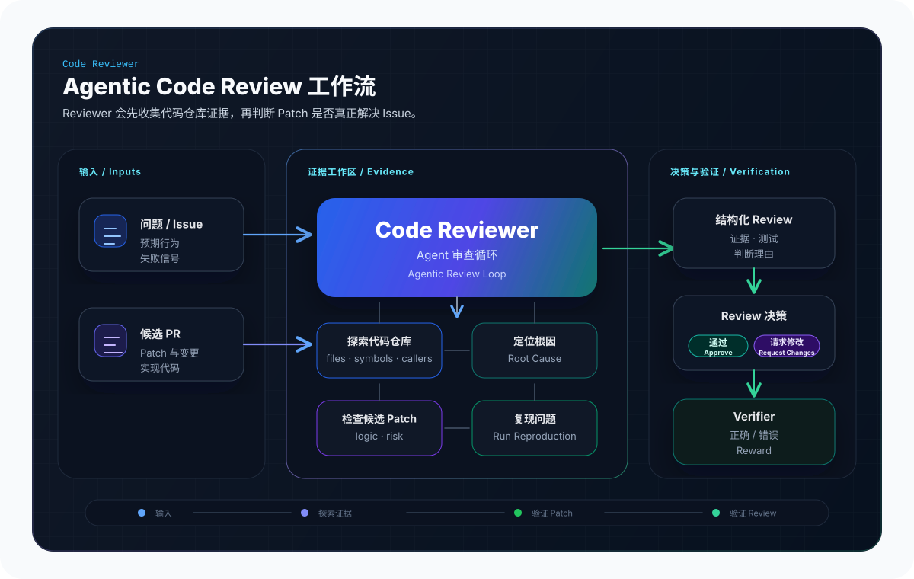
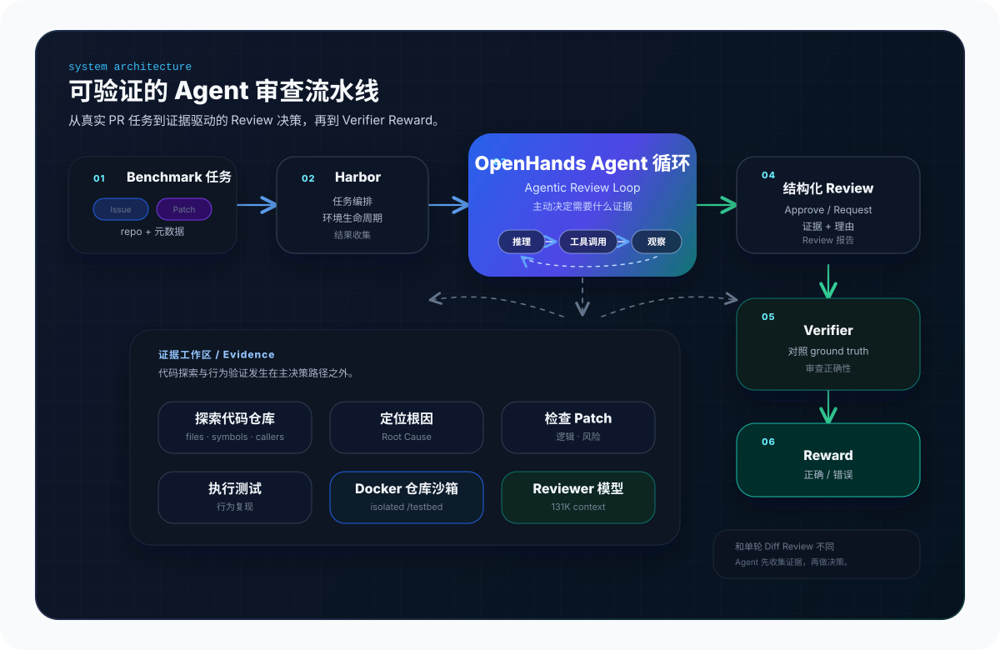
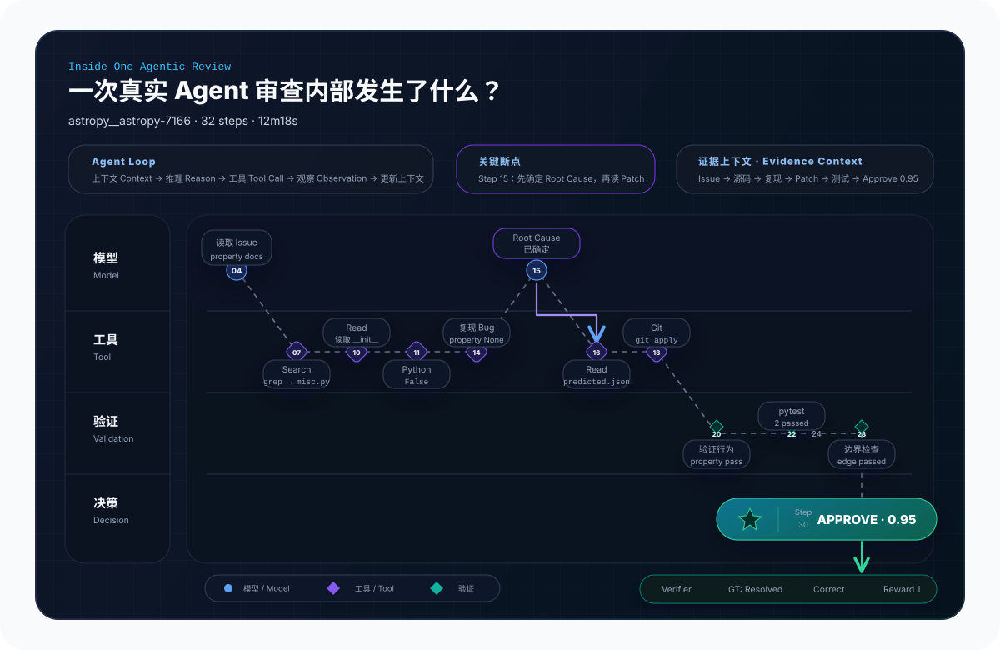
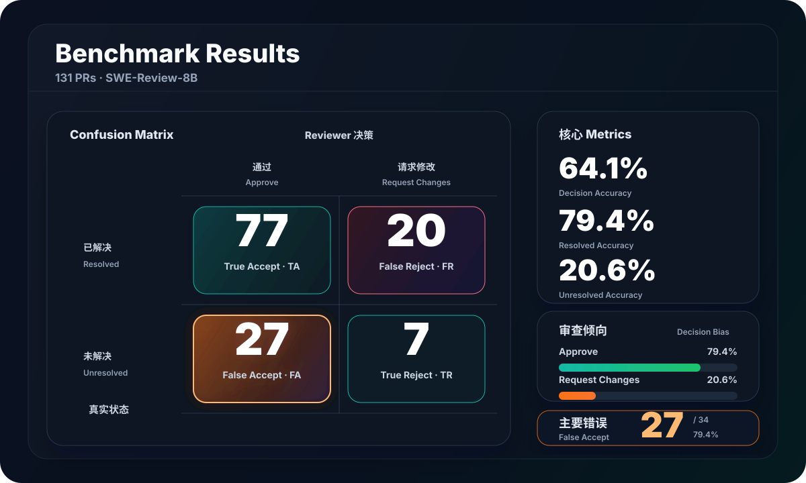
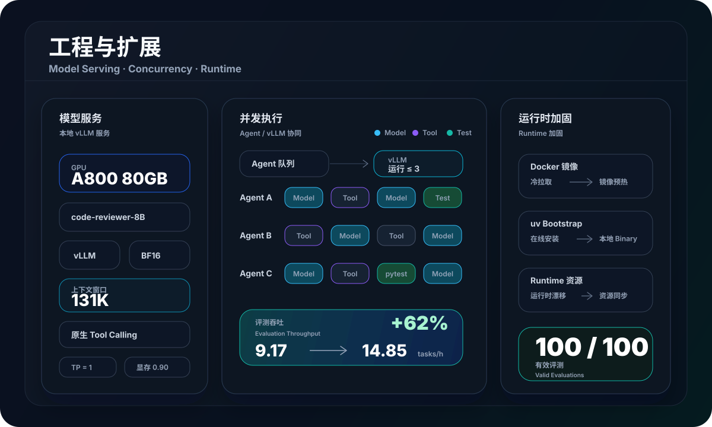

<div align="center">

<h1>Code Reviewer</h1>

<p><strong>面向真实 Issue 与 Candidate PR 的 Agentic Code Review 系统</strong></p>

<p>不只是阅读 Diff。Reviewer 会主动探索代码仓库、定位 Root Cause、执行测试与行为验证，再给出 Approve / Request Changes 决策，并通过 Verifier 自动评估审查结果。</p>

<p>Explore Repository · Trace Root Cause · Validate Patch · Make Decision · Verify</p>

</div>

<p align="center">
  
</p>

| 真实 PR 样本 | 审查决策准确率 | 正确 PR 识别率 | 长上下文 |
|:---:|:---:|:---:|:---:|
| **131** | **64.1%** | **79.4%** | **131K** |
| Unique PRs | Decision Accuracy | Resolved PR Accuracy | Context Window |

> **Code Reviewer 的核心不是“让大模型看更多代码”，而是让 Reviewer 主动决定需要什么证据。**
> 它可以搜索仓库、阅读调用链、复现问题、执行测试，再基于代码与运行结果判断一个 Patch 是否真正解决了 Issue。

## Highlights

- **Agentic Code Review**：Reviewer 可主动搜索仓库、执行 Shell / Git / Pytest，在真实代码环境中收集证据后形成审查结论。
- **Reviewer Model**：基于 Agentic Review trajectories 构建代码审查专用 `code-reviewer-8B`，由 vLLM 提供 131K Context 与原生 Tool Calling。
- **Evaluation & Analysis**：完成 131 个互不重复 PR 评测，并用混淆矩阵与误判样本分析 Reviewer 决策行为。
- **Engineering & Scaling**：完成本地模型 serving、Docker 沙箱、环境预热与并发调优，实测评测吞吐约提升 62%。

## How It Works

Code Reviewer 将每个 Issue / Candidate PR 放入隔离的代码仓库环境，由 OpenHands 驱动 Reviewer 通过工具主动读取源码、搜索调用链、执行命令和测试。Reviewer 最终输出结构化 Review，再由 Verifier 根据 benchmark ground truth 判断审查决策是否正确。

<p align="center">
  
</p>

### Review Lifecycle

1. **加载任务** — 读取 Issue、Candidate Patch 和仓库环境
2. **独立理解问题** — 在查看 Patch 前定位相关代码与 Root Cause
3. **探索与验证** — 通过 Read / Search / Shell / Test 收集证据
4. **评估 Patch** — 应用并检查 Candidate Patch 是否解决问题
5. **形成 Review** — 输出结构化 Approve / Request Changes
6. **自动验证** — Verifier 对照 Ground Truth 计算 Reward

## One Review in Action

下面是一条真实 Review 轨迹。Reviewer 并没有直接相信 Candidate Patch，而是先独立定位问题、复现 Bug，再检查 Patch 并执行验证。

| Instance | Decision | Confidence | Steps | Runtime | Reward |
|:---|:---:|:---:|:---:|:---:|:---:|
| `astropy__astropy-7166` | ✅ Approve | 0.95 | 32 | 12m18s | 1 |

Repository: `astropy/astropy` · Base commit: `26d147868f8a891a6009a25cd6a8576d2e1bd747`

下面不是一条预先定义好的工作流，而是一条真实的 Agent Event Trace。Reviewer 会在多轮「模型推理 → 工具调用 → Observation → 上下文更新」中逐步累积证据，动态决定下一步行动。

<sub>This is a real agent trace, not a predefined workflow.</sub>

<p align="center">
  
</p>

### Bug 现象

Astropy 的 `InheritDocstrings` metaclass 可以让 subclass method 自动继承父类 docstring，但 property 不行。

Root Cause 很小：原实现只检查 `inspect.isfunction(val)`，而 Python property 的类型是 `<class 'property'>`，所以 property 根本不会进入 docstring inheritance 分支。

```text
Method:
Base.method.__doc__
      ↓
Derived.method.__doc__ ✅

Property:
Base.prop.__doc__
      ↓
Derived.prop.__doc__ ❌ None
```

### Candidate Patch

核心修改来自真实 `predicted.json`，这里只展示最关键的 diff：

```diff
         for key, val in dct.items():
-            if (inspect.isfunction(val) and
-                is_public_member(key) and
-                val.__doc__ is None):
-                for base in cls.__mro__[1:]:
-                    super_method = getattr(base, key, None)
-                    if super_method is not None:
-                        val.__doc__ = super_method.__doc__
-                        break
+            if is_public_member(key):
+                if inspect.isfunction(val):
+                    if val.__doc__ is None:
+                        for base in cls.__mro__[1:]:
+                            super_method = getattr(base, key, None)
+                            if super_method is not None:
+                                val.__doc__ = super_method.__doc__
+                                break
+                elif isinstance(val, property):
+                    if val.__doc__ is None:
+                        for base in cls.__mro__[1:]:
+                            super_property = getattr(base, key, None)
+                            if super_property is not None:
+                                val.__doc__ = super_property.__doc__
+                                break
```

Patch 显式处理 property，同时保留原有 method inheritance 路径。

### 证据收集

#### ① Reproduced the bug

```text
Method docstring: Base method docstring
Property docstring: None
```

#### ② Verified the patch

```text
Method correct: True
Property correct: True
```

#### ③ Ran tests

```text
test_inherit_docstrings
→ 1 passed

test_inherit_docstrings_property
→ 1 passed

-k "inherit"
→ 2 passed
```

额外的 property 边界场景也通过。

### 最终决策

✅ **APPROVE**

Confidence: **0.95**

- 修复发生在 Root Cause 位置；
- property 的 docstring inheritance 被正确补齐；
- 原有 method 行为保持；
- targeted tests 与 edge cases 均通过。

```text
Candidate Patch
→ Approve
→ Ground Truth: Resolved
→ Verifier: Correct
→ Reward: 1
```

<details>
<summary>Raw artifacts</summary>

```text
outputs/official100-new/retry50/tasks/astropy__astropy-7166/environment/data/problem_statement.txt
outputs/official100-new/retry50/tasks/astropy__astropy-7166/environment/data/predicted.json
outputs/official100-new/retry50/results-final/2026-09-12__22-49-35/astropy__astropy-7166__2C2kQKs/agent/trajectory.json
outputs/official100-new/retry50/results-final/2026-09-12__22-49-35/astropy__astropy-7166__2C2kQKs/agent/openhands_sdk.txt
outputs/official100-new/retry50/results-final/2026-09-12__22-49-35/astropy__astropy-7166__2C2kQKs/verifier/review_report.json
outputs/official100-new/retry50/results-final/2026-09-12__22-49-35/astropy__astropy-7166__2C2kQKs/verifier/report.json
outputs/official100-new/retry50/results-final/2026-09-12__22-49-35/astropy__astropy-7166__2C2kQKs/verifier/reward.txt
```

</details>

<sub>32 agent steps · 12m18s · 893K total tokens</sub>

## Benchmark Results

Code Reviewer 在固定 PR 子集上完成审查评测，并记录每个 Candidate PR 的 Approve / Request Changes 决策结果。

| 样本数 | Decision Accuracy | Resolved Accuracy | Unresolved Accuracy |
|:---:|:---:|:---:|:---:|
| **131** | **64.1%** | **79.4%** | **20.6%** |
| Unique PRs | Decision Accuracy | Resolved PR Accuracy | Unresolved PR Accuracy |

<p align="center">
  
</p>

### What We Learned

- 131 个样本上的 Decision Accuracy 为 **64.1%**。
- 97 个 resolved PR 中，**77 个正确 Approve**。
- 34 个 unresolved PR 中，仅 **7 个正确 Request Changes**，其余 **27 个被错误放行**。
- 当前 Reviewer 的主要错误类型是 **False Accept**。

### General LLM vs Review-SFT

这里只比较完全相同的 **31 个 paired PR**，不和上面的 131-instance aggregate 混用。

| Metric | GPT-5.6 Luna | code-reviewer-8B |
|---|---:|---:|
| Decision Accuracy | 58.1% | **64.5%** |
| Resolved PR Accuracy | 42.9% | **85.7%** |
| Unresolved PR Accuracy | **90.0%** | 20.0% |
| False Reject Rate | 57.1% | **14.3%** |
| False Accept Rate | **10.0%** | 80.0% |

同样的 31 个 PR 上，Review-SFT 模型减少了通用模型的 over-rejection，但决策偏置转向另一端，出现 over-approval。

Paired transition：Luna 的 12 个 False Reject 中，**11 个**转为 True Accept；但 Luna 原本正确识别的 bad PR 中，**7 个**转为 False Accept。

## Engineering & Scaling

Code Reviewer 的一次完整 Review 往往持续数分钟，并涉及多轮模型推理、Tool Call、Docker 沙箱执行和测试，因此评测性能不仅取决于模型推理速度，也受到环境初始化、镜像拉取和 Agent 并发的影响。

为了稳定运行大规模评测，对 Model Serving、Sandbox Bootstrap 和并发策略进行了单独优化。

<p align="center">
  
</p>

### Model Serving

- 在 NVIDIA A800 80GB 上使用 vLLM 部署 code-reviewer-8B。
- 支持 131K Context、BF16、Tensor Parallel = 1、GPU Memory Utilization = 0.90。
- Agent 通过本地 OpenAI-compatible endpoint 调用 Reviewer，并启用 Native Tool Calling 与 `hermes` Tool Call Parser。

### Concurrency

- 31-task run 使用 Harbor Agent concurrency = 3，约 3:22:56 完成，吞吐约 **9.17 tasks/h**。
- 后续 8-task perf run 中，实际最大 model Running 约为 3，8 tasks / 32m19s，吞吐约 **14.85 tasks/h**。
- 通过增大 Agent-side task queue，使 GPU 在任务环境切换、Tool Call、Shell、Git、pytest 和 repo exploration 期间持续获得新的推理请求。

### Infrastructure Hardening

| Bottleneck | Hardening |
|---|---|
| Docker image pull / mirror failure | 移除失效镜像源 + 镜像预热 |
| Online uv bootstrap | 本地 uv binary + fallback installer |
| Runtime asset drift | 同步必需 runtime 资源到 active package |

> 经过环境预热和 runtime hardening 后，完成新增 **100 / 100 有效样本评测**。

## Notes

- 当前 Benchmark 结果来自固定的 **131 个互不重复 PR 子集**，不代表完整 SWE-Review-Bench 官方结果。
- `9.17 → 14.85 tasks/h` 来自不同规模的实际并发实验，用于反映 runtime 调优趋势，并非严格同 workload 的 microbenchmark。

## References

- [SWE-Review-Bench](https://huggingface.co/datasets/Lego-X/SWE-Review-Bench) — benchmark
- [SWE-Review-Traj](https://huggingface.co/datasets/Lego-X/SWE-Review-Traj) — review trajectories
- [code-reviewer-8B](https://huggingface.co/Lego-X/SWE%2DReview%2D8B) — reviewer model
- [SWE-bench Verified](https://www.swebench.com/) — benchmark subset
- [OpenHands SDK](https://docs.openhands.dev/sdk) — software agent SDK
- [Harbor](https://github.com/harbor-framework/harbor) — agent evaluation harness
- [vLLM](https://github.com/vllm-project/vllm) — model serving
